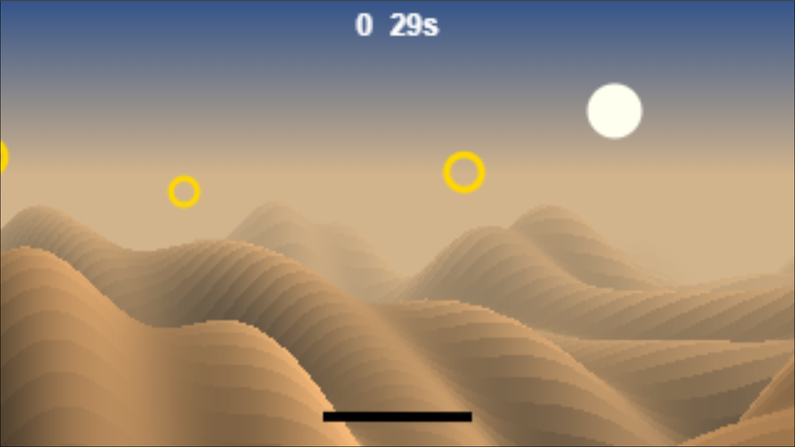
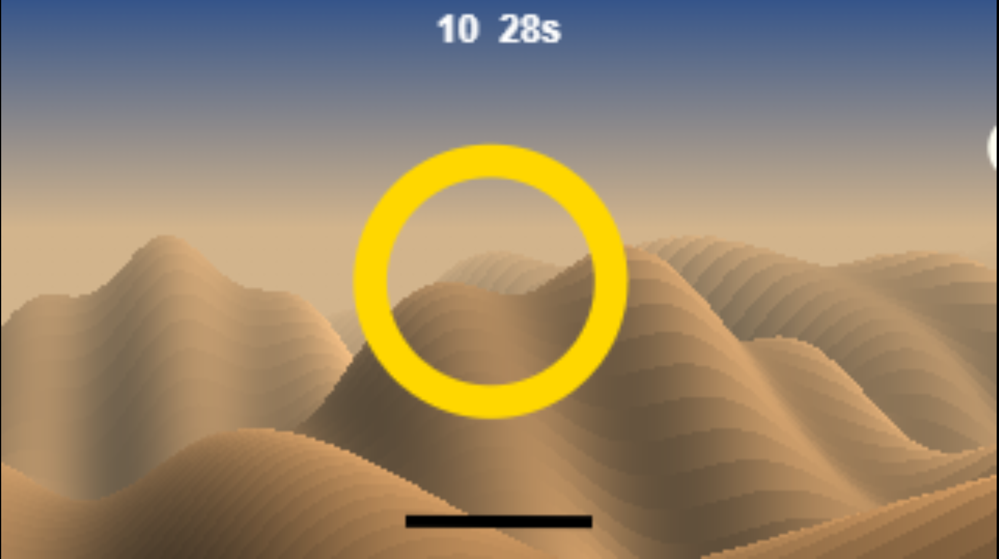
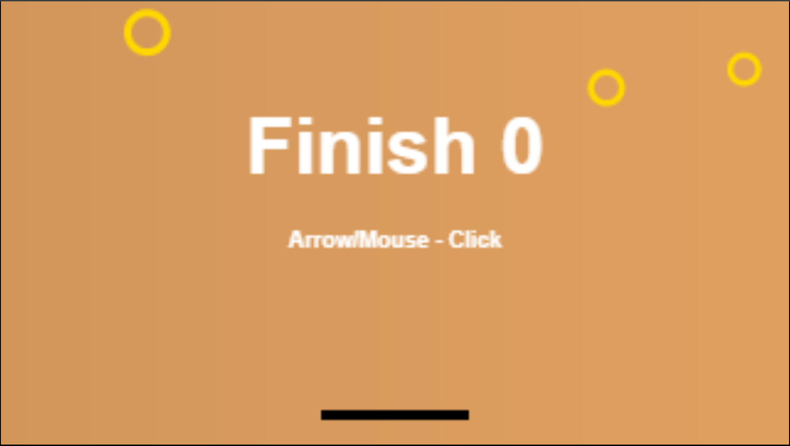
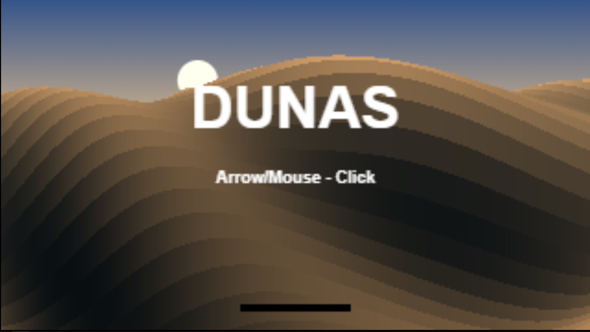

# Dunas

Dunas is a tiny experimental 3D game built entirely with HTML, Javascript and 2D canvas, without libaries, frameworks, or external assets.

The goal is simple: fly over a procedurally generated desert, avoid obstacles, and collect them to gain time and speed. The project was created to explore how far a 3D expreience can be pushed only small amount of Javascript and mathematical redering techiniques

# How do I run the game?

Just click [here](https://github.com/Developer-Vini/Dunas/blob/main/dist/uri.txt), copy the link and paste it into your browser, it's that simple!

# 🎮 How to Play?
You control an aircraft flyng over an endless desert

- ← / → — turn
- ↑ / ↓ — control altitude and speed
- Mouse — control the aircraft
- Click — start/restart and enable audio

Collect the golden rings to:

- gain points;
- recover time;
- increase your altitude;
- temporarily increase your speed.

# Screenshots

